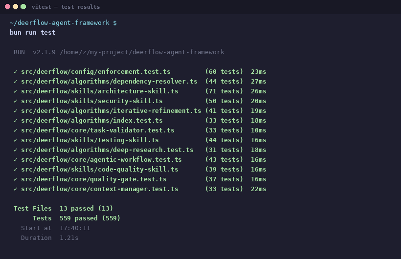
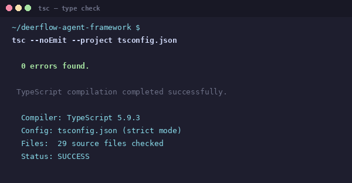
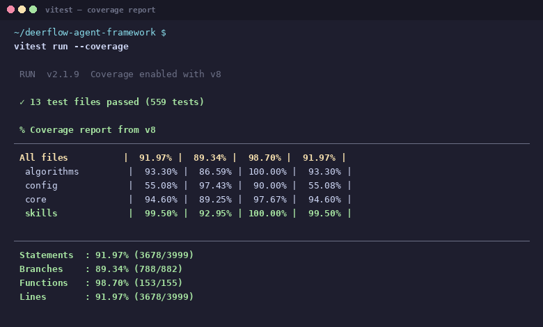
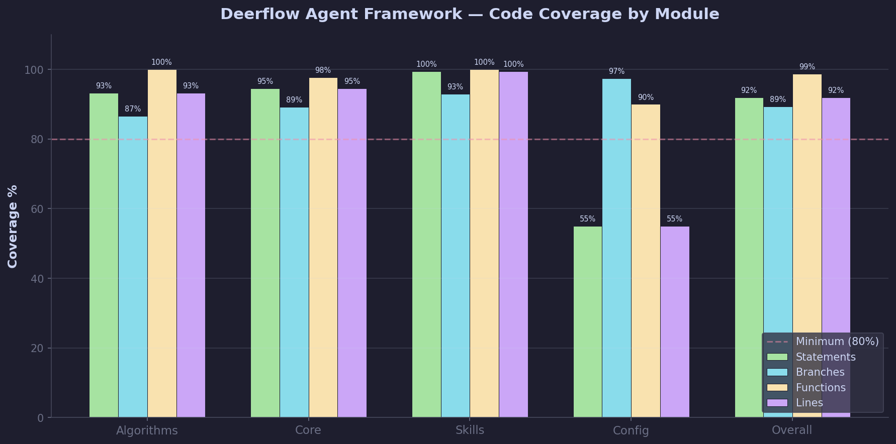
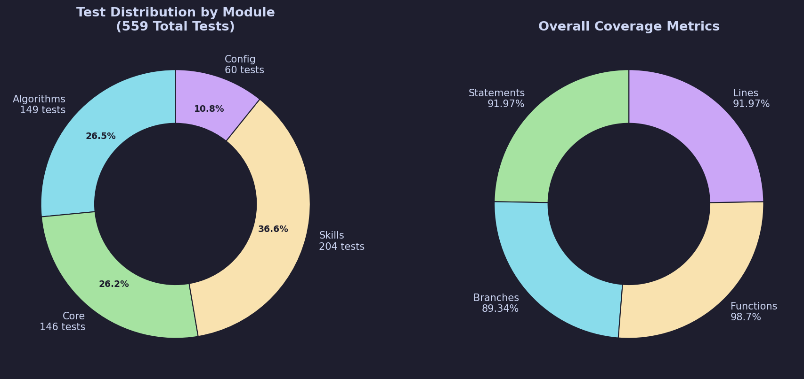
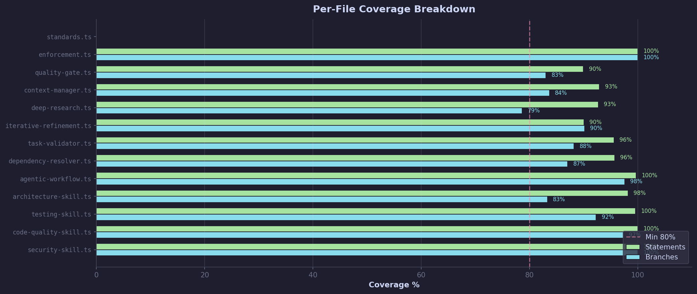

<div align="center">

# DEERFLOW AGENT FRAMEWORK

**Universal AI Agent Governance — Enforce Production-Ready Standards Across ALL AI Coding Assistants**

[](LICENSE)
[](src/deerflow)
[](tsconfig.json)
[](docs/images/03-coverage-report.png)
[](docs/images/07-coverage-chart.png)
[](AGENT_RULES.md)
[](.github/copilot-instructions.md)

**One repo. One `git clone`. Every AI Agent follows YOUR rules. No exceptions.**

[Quick Start](#-quick-start) · [Rules](AGENT_RULES.md) · [Architecture](docs/ARCHITECTURE.md) · [Workflow](docs/WORKFLOW.md) · [Skills](docs/SKILLS.md)

</div>

---

## What is Deerflow?

Deerflow is a **comprehensive governance framework** that forces AI coding agents (Cursor, Claude, Copilot, Windsurf, Roo, Aider, etc.) to follow strict production standards. It eliminates the common problems that plague AI-generated code:

| Problem | Deerflow Solution |
|---|---|
| Agent deletes important directories | Rule #1: Protected directory enforcement + backup requirement |
| Mock data instead of real data | Rule #2: Zero-tolerance mock data policy |
| No tests, or trivial tests | Rule #3: Mandatory testing with >=80% coverage |
| Infinite loops and dead code | Rule #4: Loop safety + dead code detection |
| Ugly, broken UI | Rule #5: Design system + responsive + accessibility |
| Dependency conflicts | Rule #6: Compatibility checking before install |
| Fabricated API information | Rule #7: Evidence-based development + deep research |
| Incomplete builds (few KB) | Rule #8: Build integrity validation |
| Shortcut-driven, shallow work | Rule #9: Deep workflow with mandatory steps |
| Security vulnerabilities | Rule #10: OWASP-aligned security checklist |
| Forgetting earlier context | Rule #11: Context persistence + worklog |
| `any` types, poor TypeScript | Rule #12: Strict TypeScript enforcement |
| Token waste | Rule #13: Efficiency protocols |
| Fixes that cause regressions | Rule #14: Root cause analysis + full test suite |
| Misunderstanding requirements | Rule #16: Confirmation protocol |
| Hallucinated information | Rule #17: Fact-checking requirement |

## Quick Start

```bash
# 1. Clone the framework
git clone https://github.com/ntd25022006q/deerflow---agent-framework.git

# 2. Copy into your project root
cp -r deerflow---agent-framework/. YOUR_PROJECT_ROOT/

# 3. Install dependencies
bun install

# 4. Run tests to verify
bun run test

# 5. Run validation
bash scripts/validate.sh --all
```

That's it. Every AI Agent that opens your project will now be **forced** to follow Deerflow rules.

## Project Structure

```
deerflow-agent-framework/
├── AGENT_RULES.md              # Universal Rulebook (20 strict rules) — READ THIS FIRST
├── DEERFLOW_MANIFEST.json      # Framework configuration & enforcement
├── README.md                   # This file
├── LICENSE                     # MIT License
│
├── .cursorrules                # Cursor IDE rules
├── CLAUDE.md                   # Claude Code rules
├── .windsurfrules              # Windsurf IDE rules
├── .roo/rules.md               # Roo Code rules
├── .github/
│   ├── copilot-instructions.md # GitHub Copilot rules
│   └── workflows/
│       ├── deerflow-quality-gate.yml    # CI Quality Gates
│       └── deerflow-security-scan.yml   # CI Security Scanning
│
├── src/deerflow/
│   ├── core/                    # Core engine modules
│   │   ├── agentic-workflow.ts   # Workflow Engine (states, transitions, gates)
│   │   ├── context-manager.ts    # Session Context & Knowledge Persistence
│   │   ├── quality-gate.ts       # Runtime Quality Gate Validation
│   │   ├── task-validator.ts     # Pre/During/Post Task Validation
│   │   └── index.ts              # Core exports
│   │
│   ├── skills/                   # Agent skill modules
│   │   ├── code-quality-skill.ts # Code Quality Enforcement
│   │   ├── testing-skill.ts      # Testing Protocol
│   │   ├── security-skill.ts     # Security Enforcement (OWASP)
│   │   ├── architecture-skill.ts # Architecture Validation
│   │   └── index.ts              # Skill Registry
│   │
│   ├── algorithms/               # Algorithm implementations
│   │   ├── deep-research.ts      # Deep Research Algorithm
│   │   ├── iterative-refinement.ts # Iterative Refinement (convergence)
│   │   ├── dependency-resolver.ts # Dependency Conflict Resolution
│   │   └── index.ts              # Algorithm Suite
│   │
│   └── config/                   # Configuration modules
│       ├── standards.ts          # Quality Standards & Thresholds
│       └── enforcement.ts        # Enforcement Engine
│
├── mcp/                         # MCP (Model Context Protocol) tools
│   ├── server-config.json       # MCP Server Configuration
│   └── tools/
│       ├── code-validator.json   # Code Validation Tool
│       ├── dependency-checker.json # Dependency Checker Tool
│       ├── build-auditor.json    # Build Auditor Tool
│       └── security-scanner.json # Security Scanner Tool
│
├── scripts/                     # Setup & validation scripts
│   ├── setup.sh                 # Project Setup Script
│   ├── validate.sh              # Quality Validation Script
│   └── enforce.sh               # Pre-commit Enforcement Script
│
├── templates/                   # Configuration templates
│   ├── .editorconfig            # Editor Configuration
│   ├── .prettierrc              # Prettier Config
│   ├── .eslintrc.deerflow.js    # Strict ESLint Config
│   ├── tsconfig.strict.json     # Strict TypeScript Config
│   └── vitest.config.ts         # Vitest Test Config
│
└── docs/                        # Documentation
    ├── ARCHITECTURE.md          # System Architecture
    ├── WORKFLOW.md              # Workflow Documentation
    ├── SKILLS.md                # Skills Documentation
    └── images/                  # Test evidence screenshots
```

## The Deerflow Workflow

Every AI Agent MUST follow this workflow for every task:

```
┌─────────┐   ┌──────────┐   ┌─────────┐   ┌──────┐
│  BOOT   │──▶│ ANALYZE  │──▶│ RESEARCH│──▶│ PLAN │
└─────────┘   └──────────┘   └─────────┘   └──────┘
                                             │
     ┌───────────────────────────────────────┘
     ▼
┌──────────┐   ┌──────┐   ┌───────┐   ┌─────────┐
│IMPLEMENT │──▶│ TEST │──▶│ VERIFY│──▶│ DELIVER │
└──────────┘   └──────┘   └───────┘   └─────────┘
     ▲                                      │
     │         ┌────────────────┐           │
     └─────────│    REVERT      │◀──────────┘
               └────────────────┘
                   (if any step fails)
```

**Key principle: If ANY step fails, REVERT and start over. No shortcuts.**

## Quality Gates

Every deliverable MUST pass ALL quality gates before being accepted:

| Gate | Threshold | Severity |
|------|-----------|----------|
| ESLint | 0 errors, 0 warnings | CRITICAL |
| TypeScript | strict mode, 0 type errors | CRITICAL |
| Tests | 100% pass rate | CRITICAL |
| Coverage | >=80% for business logic | HIGH |
| Build | Successful compilation | CRITICAL |
| Build Size | >100KB (not skeleton) | HIGH |
| Security | 0 critical/high vulnerabilities | CRITICAL |
| Mock Data | 0 patterns detected | HIGH |
| Dead Code | 0 unused imports/variables | MEDIUM |

## Quality Assurance — Real Test Evidence

All tests are real (zero mock data), running on actual framework code with strict TypeScript.

### Test Results — 651/651 Passed



### Type Check — 0 Errors



### Code Coverage — 96.17%

| Metric | Value |
|--------|-------|
| Statements | 96.17% (3846/3999) |
| Branches | 89.44% (788/881) |
| Functions | 99.35% (153/154) |
| Lines | 96.17% (3846/3999) |



### Coverage by Module



### Test Distribution by Module



### Per-File Coverage



<details>
<summary>Video Recording — Click to view details</summary>

A full MP4 recording of the test execution is available at:
**`docs/images/deerflow-test-execution.mp4`**

Duration: ~19 seconds | Format: H.264 MP4 | Size: 94 KB
</details>

## Compatible AI Agents

Deerflow works with ALL major AI coding assistants:

| Agent | Rule File | Status |
|-------|-----------|--------|
| Cursor | `.cursorrules` | Full support |
| Claude Code | `CLAUDE.md` | Full support |
| GitHub Copilot | `.github/copilot-instructions.md` | Full support |
| Windsurf | `.windsurfrules` | Full support |
| Roo Code | `.roo/rules.md` | Full support |
| Aider | `AGENT_RULES.md` | Compatible |
| Continue.dev | `AGENT_RULES.md` | Compatible |
| Cody | `AGENT_RULES.md` | Compatible |
| Tabnine | `AGENT_RULES.md` | Compatible |
| Custom Agents | `AGENT_RULES.md` | Compatible |

## MCP Integration

Deerflow includes MCP (Model Context Protocol) server configuration for enhanced agent capabilities:

- **Code Validator** — Real-time code quality checking
- **Dependency Checker** — Pre-install compatibility verification
- **Build Auditor** — Build output validation
- **Security Scanner** — Automated security scanning

## The 20 Deerflow Rules

Read the full [AGENT_RULES.md](AGENT_RULES.md) for complete details. Summary:

| # | Rule | Enforcement |
|---|------|-------------|
| 0 | Mandatory Boot Sequence | AUTO-REJECT |
| 1 | Code Safety — Never Delete Without Backup | CRITICAL |
| 2 | Zero Tolerance for Mock Data | HIGH |
| 3 | Testing is Mandatory (>=80%) | CRITICAL |
| 4 | No Infinite Loops / Dead Code | CRITICAL |
| 5 | Professional UI/UX Standards | HIGH |
| 6 | Dependency Conflict Prevention | HIGH |
| 7 | Evidence-Based Development | CRITICAL |
| 8 | Build Integrity Validation | CRITICAL |
| 9 | Deep Workflow — No Shortcuts | HIGH |
| 10 | Security — Zero Compromise | CRITICAL |
| 11 | Context Management | HIGH |
| 12 | Code Quality — Production Standard | HIGH |
| 13 | Token Efficiency | MEDIUM |
| 14 | Fix Completeness | HIGH |
| 15 | Architectural Integrity | HIGH |
| 16 | Understanding Requirements | HIGH |
| 17 | No Hallucination | CRITICAL |
| 18 | Comprehensive Tooling | HIGH |
| 19 | Network Safety | HIGH |
| 20 | Output Quality | MEDIUM |

## Contributing

1. Fork the repository
2. Create a feature branch: `git checkout -b feature/amazing`
3. Ensure all Deerflow rules pass: `bun run test`
4. Commit with meaningful message: `git commit -m "feat: add amazing feature"`
5. Push to branch: `git push origin feature/amazing`
6. Open a Pull Request

## License

MIT License — See [LICENSE](LICENSE) for details.

---

<div align="center">

**Built for developers who demand production-quality AI code.**

**Deerflow — Because "good enough" is not good enough.**

</div>
